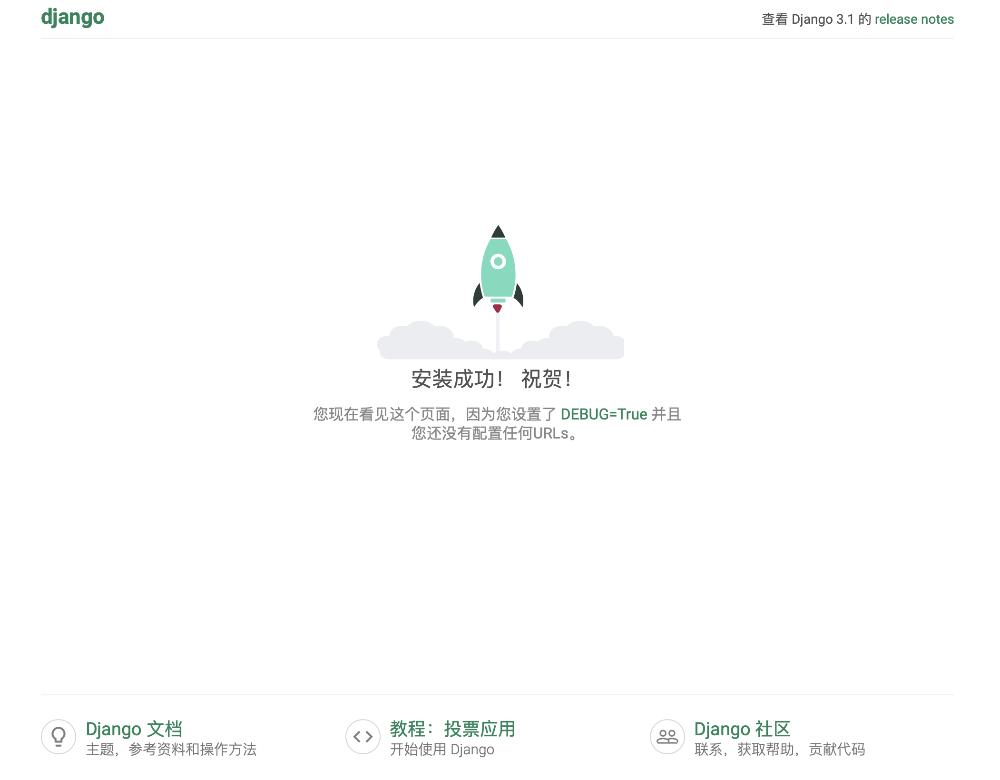

# Day0

## 1. 课程介绍


*上课直播地址*

https://ke.qq.com/course/3138265


## 2. 统计

岗位

Django熟悉程度 5颗星

DRF 是否用过

## 3. 环境准备

Mac + Win

### 1. 项目环境

- [Python 3.6.8](https://51reboot.oss-cn-beijing.aliyuncs.com/Python-3.6.8.tgz)
- Django 3.1
- [MySQL 5.7.30](https://51reboot.oss-cn-beijing.aliyuncs.com/mysql-5.7.30-1.el6.x86_64.rpm-bundle.tar)
- Redis 3.x
- Pycharm
  - Mac
  - Win
- VM
  - Virtualbox
    - [Mac](https://51reboot.oss-cn-beijing.aliyuncs.com/VirtualBox-6.1.10-138449-OSX.dmg)
    - [Win](https://51reboot.oss-cn-beijing.aliyuncs.com/VirtualBox-6.1.6-137129-Win.exe)
  - Vagrant
    - [Mac](https://51reboot.oss-cn-beijing.aliyuncs.com/vagrant_2.2.9_x86_64.dmg)
    - [Win](https://51reboot.oss-cn-beijing.aliyuncs.com/vagrant_2.2.7_x86_64.msi)
  - [Vagrantfile](https://51reboot.oss-cn-beijing.aliyuncs.com/Vagrantfile)
  - [centos 6.6](https://51reboot.oss-cn-beijing.aliyuncs.com/centos-6.6-x86_64.box)


#### Vagrant + virtualbox

> CentOS 7.x

```bash
$ mkdir vagrant
$ cd vagrant
$ wget https://51reboot.oss-cn-beijing.aliyuncs.com/Vagrantfile 

$ wget https://51reboot.oss-cn-beijing.aliyuncs.com/centos-66-devops11-2021-0306.box
$ vagrant box add <centos66-devops11> centos-66-devops11-2021-0306.box

$ vim Vagrantfile    // 指定要用哪个box, 修改本地目录共享到Vm目录中
$ vagrant box list

$ vagrant up   			// 创建1台虚拟机
$ vagrant reload
$ vagrant status
$ vagrant halt

$ vagrant ssh // 进入虚拟机
```


### 2. 开通github仓库权限

[项目代码仓库](https://github.com/51Reboot/devops11)

[上课笔记面试题](https://github.com/51Reboot/devops11-interview)


### 3. 验证环境





## 4. 面试心法

**面试** = *编程*(基础/算法) + *项目*


## 5. 作业

- [做好上课笔记，通过gitbook管理](https://github.com/51Reboot/devops11)
- [提交自已在面试过程中被问到到面试题，并提交到仓库](https://github.com/51Reboot/devops11-interview)


*注意*

nvm管理 gitbook版本 建议v10.6.0


## 6. 工具

### 1. Vagrant导出

- 关闭 virtualbox

```bash
$ vagrant halt
```

- 查看当前启动的 virtualbox 列表

```bash
$ vboxmanage list vms
"vagrant_default_1592717926574_55107" {3ca7c8f0-2365-4c10-8c4c-edcdbadb692a}
"vm_default_1615007142786_48113" {8377f91d-e2e1-42f5-9a4b-decb3be50178}
"vm_default_1615022266225_83585" {c1094ad4-72be-49db-b726-829de0eb57db}
```

- 导出命令

```bash
# vagrant package --base vagrant_default_1592717926574_55107 --output centos-66-devops11-2021-0306.box
```


### 2. Vagrant命令

- 查看登陆信息

```bash
$ vagrant ssh-config


* IdentityFile * 
```

- 删除box

```bash
$ vagrant box remove centos66-devops11
```

